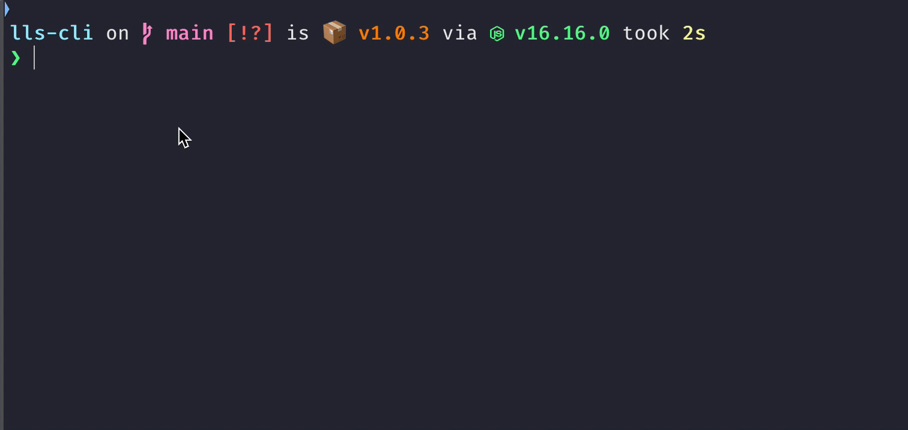

# lls-cli

A tool of list nodejs project node scripts and execute it.

[](https://www.npmjs.com/package/lls-cli)
[](https://github.com/kingzez/lls-cli)
[](https://github.com/kingzez/lls-cli)
[](https://github.com/kingzez/lls-cli)

<p align="center">
	<br>
	
	<br>
</p>

## Install

```bash
npm i -g lls-cli
```

**Requirement**: Node version >= 16.0.0

## Usage

Execute `lls` in the project root directory, you will see node scripts list

```bash
$ lls

? select node script › - Use arrow-keys. Return to submit.
❯   fmt - prettier --write .
    build
```

## License

MIT
